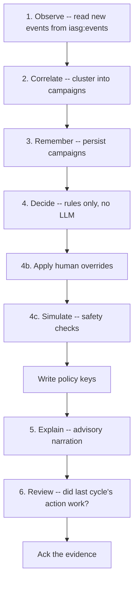

# Control Plane

## Overview

The control plane is a Python agent in `control-plane/`. It runs on a timer,
entirely off the request path, and is the only component that reasons about
attacks rather than merely recognising them.

```bash
python -m iasg                 # run forever, default 30s interval
python -m iasg --once          # a single cycle, then exit
python -m iasg --dry-run       # decide everything, write no policy
python -m iasg --interval 10   # override the cadence
```

## The cycle

Each cycle is six steps. The ordering encodes who outranks whom.



This is an operational sequence, not six more decision algorithms. The five core
mechanisms are deterministic detectors, adaptive endpoint baselines, campaign
correlation, the risk/confidence policy engine, and an optional advisory
Redis delivery, policy TTLs, safety simulation, and narration
preserve those mechanisms' boundaries.

Three things about that order are deliberate:

- **IP reputation is optional context, not independent authority.** The live
  adaptive risk engine excludes it from the deterministic-evidence floor and
  risk score, and the default gateway configuration does not arm it for reflex
  enforcement. The legacy `reputation_bias` helper has no production caller.
- **Decisions are made by rules, with no LLM anywhere near them.** The
  language model is used for narration only, and it runs *after* the decision
  already exists. A model that is unavailable, slow, or wrong cannot change
  what gets enforced.
- **A person outranks the agent.** Overrides are read before anything is
  decided, so an operator blocking an address does not have to wait for the
  agent to notice a campaign first. Disagreement is also the only thing here
  worth learning from, and it feeds the feedback memory.
- **Simulation runs last**, so nothing reaches the gateway without passing the
  safety checks — whoever asked for it. An allowlisted range is protected from
  a mistyped human instruction exactly as it is from the agent.

Evidence is acknowledged only at the very end, once everything above has
succeeded.

A cycle with no evidence is not a wasted one. Step 6 asks whether the previous
cycle's action changed anything, and silence is the signal that it did.

## Campaigns

Correlation groups activity by shared behaviour rather than by address, so an
attack that rotates IPs stays one campaign. A campaign carries:

| Field | Meaning |
| --- | --- |
| `campaign_id` | Stable identifier |
| `type` | e.g. `Brute Force`, `SQL Injection Probing` |
| `confidence` / `severity` | How sure, and how bad |
| `status` | `active`, or closed out |
| `ips` / `stages` | Who, and which phases have been seen |
| `event_count` | Evidence volume |
| `quiet_cycles` | Consecutive cycles with nothing new |
| `rotations` | How often the address set has changed |
| `last_action` / `outcome` | What was done, and whether it worked |

## The escalation ladder

Actions escalate one rung at a time, and each rung carries its own lifetime:

| Action | TTL | Effect at the gateway |
| --- | --- | --- |
| `monitor` | 300s | Never written — it would be a no-op key |
| `throttle` | 900s | Enforce the policy's `requests_per_minute` per IP, exact path, and method; return `429` with `Retry-After` when exhausted |
| `temp_block` | 1800s | Refuse with 403 |
| `escalate` | 3600s | Gateway returns `403`; Python separately records a human-review alert |

Escalation is the one action that asks for a person, so it is raised after the
explanation step — the alert then carries something readable.

The alert is appended once per campaign to the existing `iasg_alerts` Redis
stream; the gateway does not send a notification or call Python. Throttle
policies retain the existing JSON fields, including `source` and
`requests_per_minute`. Shared Redis token buckets enforce the rate across
gateway replicas without sleeping, while policy lookup remains a local
background-refreshed snapshot. Real Redis TTL controls expiry.

Every rung expires by itself. See [Policy Enforcement](policy-enforcement.md)
for why that is non-negotiable on both sides of the contract.

## Storage

| Store | Holds | Notes |
| --- | --- | --- |
| Redis | Evidence stream, policy keys, overrides, heartbeat | Always required |
| Postgres | Campaigns and feedback | Optional; without it campaigns live in Redis under a TTL |

Postgres is genuinely optional and non-fatal — that is the behaviour every test
and the default deployment use. When it is configured, campaigns and feedback
survive a restart, and the agent restores them into Redis on startup:

```
[postgres] campaigns and feedback are durable
[postgres] restored 1 records into Redis
[iasg] control plane started (every 30s, dry_run=False)
```

## Configuration

All settings come from the environment, via `Settings.from_env()`:

| Variable | Default | Purpose |
| --- | --- | --- |
| `IASG_REDIS_URL` | `redis://localhost:6379/0` | Where evidence and policy live |
| `IASG_EVIDENCE_STREAM` | `iasg:events` | Stream written by the gateway |
| `IASG_CONSUMER_GROUP` | `iasg-agent` | Consumer group name |
| `IASG_BATCH_SIZE` | `500` | Events read per cycle |
| `IASG_INTERVAL_SECONDS` | `30` | Cycle cadence |
| `IASG_POLICY_PREFIX` | `policy:` | Key prefix the gateway reads |
| `IASG_MAX_IPS_PER_CYCLE` | `50` | Cap on addresses actioned per cycle |
| `IASG_DRY_RUN` | `false` | Decide everything, write nothing |
| `IASG_ALLOWLIST` | empty | Comma-separated CIDRs that are never actioned |
| `IASG_POSTGRES_URL` | unset | Enables durable campaigns |
| `IASG_LLM_PROVIDER` | `null` | `null` or `ollama`; Compose also defaults to `null` |
| `IASG_OLLAMA_URL` | `http://localhost:11434` | Narration model endpoint when `ollama` is explicitly enabled; Compose points this at the *host* |
| `IASG_OLLAMA_MODEL` | `llama3.2` | Model to generate with |
| `IASG_OLLAMA_TIMEOUT_SECONDS` | `15` | Bound on one call |
| `IASG_NARRATION_BUDGET_SECONDS` | `12` | Total wall clock one cycle may spend narrating |

### Narration degrades, it never blocks

A bare `python -m iasg` defaults to `null`. That does **not** mean no output:
the explanation agent falls back to a template and still produces a readable
paragraph, while the assessment agent has no template and produces nothing at
all. Turning a model on is what makes the second one exist.

Compose defaults to the offline template provider. Set
`IASG_LLM_PROVIDER=ollama` in `infra/.env` to opt into host narration; Compose
then points at the host rather than shipping a second copy of a 2GB model.
Docker Desktop proxies `host.docker.internal` to the host loopback, so a model
listening only on `127.0.0.1` is reachable; native Linux Docker routes to the
bridge instead and needs `OLLAMA_HOST=0.0.0.0`.

Narration is two model calls per campaign, inside the cycle, so its cost scales
with how bad the hour is -- six campaigns is twelve calls, which at a few
seconds each is longer than the interval the agent runs on. `BudgetedProvider`
caps the total wall clock a cycle may spend and returns `""` once spent, which
both agents already treat as "no model" and answer with their templates. A late
decision is worse than an unnarrated one, and the cycle report says how many
calls it skipped.

## One bad cycle must not end the agent

`run_forever` catches per-cycle exceptions and continues. A heartbeat is
written to `iasg:heartbeat` each cycle so the dashboard can tell a running
agent from a stopped one.

!!! note "Logs under Docker"
    Python block-buffers stdout when it is not a TTY, which makes a working
    agent look hung. `infra/docker-compose.yml` sets `PYTHONUNBUFFERED=1` on
    the `control_plane` service for exactly this reason.

## Tests

```bash
cd control-plane && python -m pytest
```

The suite covers correlation, campaign rotation, multi-stage attacks, the
adaptive policy ladder, simulation, feedback, overrides, alerts, narration, and
both stores.

## Code references

| Path | Role |
| --- | --- |
| `iasg/__main__.py` | CLI entrypoint and flags |
| `iasg/runner.py` | The cycle, and the ordering rationale |
| `iasg/config.py` | `Settings` and environment parsing |
| `iasg/evidence/` | Stream consumer and ingest |
| `iasg/correlation/` | Clustering, features, campaign formation |
| `iasg/campaigns/repository.py` | Campaign persistence |
| `iasg/policy/simulation.py` | Safety checks before anything is written |
| `iasg/policy/writer.py` | The writing rails |
| `iasg/feedback/` | Override memory and learning |
| `iasg/explanation/`, `iasg/reasoning/` | Advisory narration, LLM providers |
| `iasg/store/` | Redis, Postgres, and in-memory stores |
