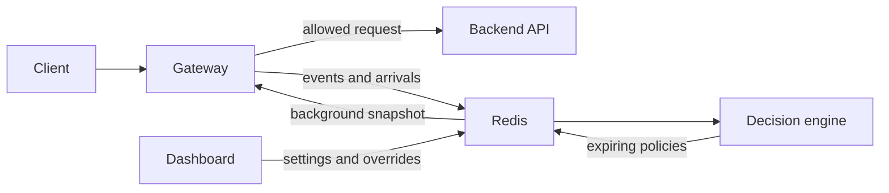

# Intelligent API Security Gateway

The Go gateway protects an HTTP API without putting slow analysis in front of a
request. It applies decisions that already exist, observes traffic, and proxies
admitted requests. The Python **decision engine** reviews the observations in
the background and creates short-lived policies.

## Start here

```bash
docker compose -f infra/docker-compose.yml up -d
```

The gateway is at `http://localhost:8082`, the dashboard at `:5177`, and this
site at `:8000`.

## Modules

| Module | Location | Job |
| --- | --- | --- |
| Gateway | `gateway/` | Resolve IPs, enforce active decisions, observe traffic, proxy requests. |
| Decision engine | `decision-engine/` | Read evidence every 30 seconds, build campaigns, and write safe expiring policy. |
| Redis | `infra/` | Live hand-off for telemetry, policies, settings, and overrides. |
| Dashboard | `gateway-dashboard/` | Live operations console for traffic, campaigns, policy, and settings. |
| Demo API | `vulnerable-app/` | Deliberately insecure backend used to demonstrate protection. |
| Tests | `testing/` | Shell and JMeter traffic for end-to-end verification. |

## Non-negotiable boundary

The gateway never waits for the decision engine, Postgres, or a model. It reads
a local policy snapshot. Redis is used synchronously only for a bounded shared
quota check when an applicable rate limit exists; errors fail open.



Continue with [System Architecture](system-architecture.md), then
[Request Lifecycle](request-lifecycle.md).
