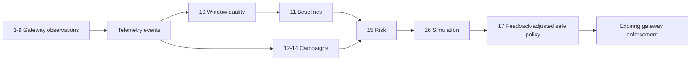

# The 17 Algorithms

This module explains the 17 deterministic procedures used by the gateway and
the decision engine. Here, “algorithm” means a repeatable rule or calculation;
it does **not** mean an LLM. The optional model only writes an explanation
after policy has already been selected.

## A. Gateway observation algorithms

| # | Algorithm | Simple explanation | Result |
| --- | --- | --- | --- |
| 1 | Trusted client-IP resolution | Use the TCP peer by default. Use `X-Forwarded-For` only if that peer is a configured trusted proxy; in a chain, scan right-to-left past trusted proxies. | One safe IP key for all later checks. |
| 2 | Sliding-window flood counting | Keep recent request timestamps per IP, remove timestamps outside the window, and compare the remaining count with the threshold. | Flood evidence and score. |
| 3 | SQL-injection signature matching | Match configured SQL-like patterns against the capped request input. | SQLi evidence; it never directly rejects the triggering request. |
| 4 | Traversal and forced-browsing matching | Match configured traversal encodings and sensitive-path patterns. | Traversal/enumeration evidence; a configured traversal hit may arm the reflex for the next request. |
| 5 | Consecutive brute-force streaks | For declared login routes, count only configured invalid-credential responses per client and target. A configured success resets that target's streak. | Brute-force evidence after the threshold. |
| 6 | Distinct unknown-route scanning | Record unique raw paths only when they do not match a route template. Repeated requests and known-route `404`s do not increase the count. | Reconnaissance evidence. |
| 7 | Object-ID enumeration | For watched object routes, count unique IDs per client and template in a time window. Refused lookups and sequential IDs increase score after the diversity threshold. | BOLA/IDOR harvesting evidence, not ownership proof. |
| 8 | Response ownership verification | Verify a caller token, hold a bounded JSON response, and compare its configured owner field to the caller claim. A foreign object becomes `404`; foreign list items are removed. | Immediate data protection plus ownership evidence. |
| 9 | Reputation cooldown | Look up the address in the bundled/optional reputation feed. The address still contributes score during its cooldown, but it only creates a fresh alert when the cooldown allows it. | Supporting context without flooding telemetry. |

All stateful gateway detectors bound retained clients, paths, identifiers, or
timestamps and evict stale records. This prevents attacker-controlled input
from becoming unbounded memory.

## B. Decision-engine algorithms

| # | Algorithm | Simple explanation | Result |
| --- | --- | --- | --- |
| 10 | Trusted completed traffic windows | Consume arrivals and completions into minute windows. Learn only from complete, healthy windows so an outage or missing telemetry cannot become normal traffic. | Reliable per-endpoint observations. |
| 11 | Rolling median and MAD baseline | Keep recent trusted endpoint rates. Calculate the median and median absolute deviation (MAD), then derive a bounded threshold. Warm-up, hysteresis, and cooldown prevent unstable changes. | A stable normal-rate baseline per method and route. |
| 12 | Union-find campaign clustering | Build one profile per IP, compare endpoint, user agent, subnet, detector, and timing, then join IPs sharing enough identity traits at the same time. Union-find makes chained matches one campaign. | Coordinated groups rather than isolated alerts. |
| 13 | Campaign confidence and classification | Score how strongly a cluster shares traits, recognize solo high-severity activity, identify stages, and derive type and severity. | An explainable campaign assessment. |
| 14 | Campaign continuation matching | Merge a new campaign with stored history when IP overlap is strong. If IPs rotated, use a deliberately strict behavior signature instead. Quiet campaigns become contained after configured quiet cycles. | One investigation across cycles instead of repeated incidents. |
| 15 | Weighted risk scoring with guardrails | Combine the strongest deterministic evidence, repeated evidence, baseline deviation, campaign severity, and confidence into a bounded score. Evidence/confidence minimums and an action ceiling can reduce the result. | `monitor`, `throttle`, or temporary-block recommendation. |
| 16 | Policy safety simulation | Before writing, apply declared allowlists and shared-address rules, inspect uncertainty, avoid weakening a standing policy, and soften only when rules allow it. | A safer action that considers collateral risk. |
| 17 | Bounded operator-feedback adjustment | Compare repeated human overrides with the engine's recommendation. Only consistent corrections move a future proposal, by at most one action rung; all guardrails still run afterwards. | Small, auditable adaptation without self-authorizing enforcement. |

## Pseudocode

The pseudocode below mirrors the same 17 algorithms above. It is simplified
for understanding; configuration supplies values such as windows, thresholds,
limits, and action ceilings.

### 1. Trusted client-IP resolution

```text
peer = IP address of the direct TCP connection

IF peer is not in trusted_proxy_ranges:
    RETURN peer

FOR address IN X-Forwarded-For, read from right to left:
    IF address is not in trusted_proxy_ranges:
        RETURN address

RETURN peer
```

### 2. Sliding-window flood counting

```text
FOR each request from client_ip:
    remove timestamps older than flood_window
    append current time to client_ip timestamps

count = number of retained timestamps
score = score based on count / threshold

IF count is greater than threshold:
    emit flood evidence
```

### 3. SQL-injection signature matching

```text
input = capped request path, query, and body content

FOR each configured SQL pattern:
    IF pattern matches input:
        save request-scoped SQLi evidence
        emit SQLi evidence for this request
        stop checking further patterns

forward the request
```

### 4. Traversal and forced-browsing matching

```text
input = request path and relevant capped request content

IF input matches a traversal pattern:
    emit high-confidence traversal evidence
ELSE IF input matches a forced-browsing pattern:
    emit enumeration evidence

forward the request
```

### 5. Consecutive brute-force streaks

```text
IF request does not match a configured login route:
    forward the request

target = optional login identity from the capped request
response = forward the request and observe its status

IF response status means invalid credentials for this route:
    streak = (client_ip, route, target)
    reset streak if its last failure is outside the window
    increment streak
ELSE IF response status means success for this route:
    clear streak for (client_ip, route, target)

IF streak failures reach the threshold:
    emit brute-force evidence
```

### 6. Distinct unknown-route scanning

```text
route = match request method and path against configured route templates

IF route is matched:
    forward the request

path = raw escaped path
remove client_ip paths older than scan_window
record path only once in the retained set

IF number of distinct paths reaches the threshold:
    emit route-scan evidence
```

### 7. Object-ID enumeration

```text
template, identifiers = match request against watched object routes

IF no watched template matches:
    forward the request

response = forward the request and observe its status
object_id = join identifiers for this object
record object_id and whether response is 401, 403, or 404
remove object IDs older than enumeration_window

score = distinct-ID score
IF distinct IDs reached the threshold:
    add a bonus for many denied responses
    add a bonus for a long sequential numeric-ID run
    emit object-enumeration evidence
```

### 8. Response ownership verification

```text
IF request route has no ownership rule:
    forward the request

caller = verify bearer token
IF caller is missing, expired, or forged:
    emit ownership evidence
    return 401
IF caller has a configured bypass role:
    forward the request

response = hold bounded backend JSON response
IF response cannot be verified:
    return 404 when on_unverifiable is deny
    otherwise release original response

IF response is one object AND object.owner != caller.id:
    emit owner-mismatch evidence
    return 404
IF response is a list:
    remove items whose owner differs from caller.id

release verified response
```

### 9. Reputation cooldown

```text
IF client_ip is not in the reputation feed:
    return no evidence

always provide the configured reputation score

IF client_ip fired inside its cooldown:
    return score without a new threshold crossing

record a new cooldown timestamp
emit reputation evidence for this request
```

### 10. Trusted completed traffic windows

```text
read new arrival records and completion records
group records by their one-minute time window and endpoint

FOR each finished window:
    IF arrivals, completions, and telemetry health show the window is incomplete:
        mark it untrusted
    ELSE:
        count endpoint requests and mark it trusted

return completed endpoint windows
```

### 11. Rolling median and MAD baseline

```text
FOR each trusted endpoint window:
    append observed request rate to recent samples
    keep only the configured number of samples

median_rate = median(samples)
mad = median(abs(sample - median_rate) for each sample)
proposed = median_rate + mad_multiplier * max(mad, minimum_mad)
proposed = clamp(proposed, minimum_threshold, maximum_threshold)

IF warm-up is complete AND hysteresis and cooldown allow a change:
    save proposed as the endpoint threshold

deviation = max(0, (observed_rate - threshold) / threshold)
```

### 12. Union-find campaign clustering

```text
build one profile per IP from its evidence
create one union-find group per IP

FOR every pair of IP profiles:
    traits = shared endpoint, user agent, subnet, detector, and timing
    identity_traits = endpoint + user agent + subnet matches

    IF timing overlaps AND at least two identity traits match:
        union both IPs into one group

FOR each union-find group:
    return its member IPs and shared traits as a candidate campaign
```

### 13. Campaign confidence and classification

```text
FOR each candidate campaign:
    calculate confidence from shared traits, timing, evidence volume, and severity

    IF one IP has immediate high-severity evidence:
        allow it to become a solo campaign

    stages = order observed attack types by time
    type = classify dominant detector and multi-stage combinations
    severity = derive from evidence and confidence

    create campaign with confidence, type, severity, stages, and reason
```

### 14. Campaign continuation matching

```text
FOR each fresh campaign:
    find saved campaign with strongest IP overlap

    IF overlap meets merge threshold:
        merge fresh evidence into saved campaign
    ELSE IF recent saved campaign has a strict matching behavior signature:
        merge as an IP-rotation continuation
    ELSE:
        create a new campaign

FOR saved campaigns not seen this cycle:
    increment quiet-cycle count
    mark contained after the configured number of quiet cycles
```

### 15. Weighted risk scoring with guardrails

```text
deterministic_score = strongest non-reputation signal
deterministic_score += bonus for repeated deterministic evidence
behavioural_score = baseline deviation * 100
campaign_score = campaign confidence * campaign severity

total_risk = weighted sum of deterministic, behavioural, and campaign scores
candidate = monitor, throttle, or temporary block based on total_risk

apply at most one learned feedback rung to candidate

IF no deterministic evidence and no explicit ready-baseline throttle:
    candidate = monitor
IF evidence count, confidence, or automatic-action ceiling is insufficient:
    reduce candidate to the safe action

return guarded action, risk score, confidence, and throttle rate
```

### 16. Policy safety simulation

```text
FOR each proposed decision:
    IF IP is declared allowlisted:
        reject enforcement

    standing = currently active policy for the same IP and scope
    IF proposed action is weaker than standing action:
        retain standing action

    IF IP belongs to a declared shared range:
        soften block to throttle
    ELSE IF IP appears shared and campaign confidence is not high:
        soften one action rung

    return the reviewed decision and reasons
```

### 17. Bounded operator-feedback adjustment

```text
WHEN an operator overrides an agent recommendation:
    direction = stronger, weaker, or unchanged
    add direction to the tally for that campaign type

WHEN calculating a later recommendation:
    net = stronger corrections - weaker corrections

    IF absolute(net) meets minimum sample count:
        bias = +1 or -1
    ELSE:
        bias = 0

move the recommendation by at most one action rung
run normal evidence, confidence, simulation, and writer safeguards afterwards
```

## Enforcement after the algorithms

An accepted decision is written only by `iasg/policy/writer.py`. It requires a
TTL, rejects unsafe address classes, obeys the per-cycle cap, and supports
dry-run mode. The gateway then refreshes those policy keys in a background
snapshot. For a throttle, a Redis Lua token bucket atomically refills and
consumes tokens by client IP, exact path, and method; its timeout is bounded
and failures allow traffic rather than holding a request.

## How the pieces connect



The gateway's local reflex is intentionally outside this list: it is a short,
configured stopgap based on one high-confidence gateway signal. It never
replaces the decision engine's campaign-based decision.

## Source map

| Algorithms | Main code |
| --- | --- |
| 1-9 | `gateway/internal/netutil/`, `gateway/internal/signals/`, `gateway/internal/ownership/` |
| 10-11 | `decision-engine/iasg/adaptive/windows.py`, `baseline.py` |
| 12-14 | `decision-engine/iasg/correlation/`, `decision-engine/iasg/campaigns/repository.py` |
| 15 | `decision-engine/iasg/adaptive/risk.py` |
| 16 | `decision-engine/iasg/policy/simulation.py`, `policy/writer.py` |
| 17 | `decision-engine/iasg/feedback/` |
