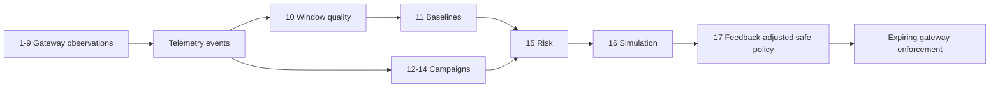

# The 17 Algorithms

This module explains the 17 deterministic procedures used by the gateway and
the decision engine. Here, “algorithm” means a repeatable rule or calculation;
it does **not** mean an LLM. The optional model only writes an explanation
after policy has already been selected.

## A. Gateway observation algorithms

| # | Algorithm | Simple explanation | Result |
| --- | --- | --- | --- |
| 1 | Trusted client-IP resolution | Use the TCP peer by default. Use `X-Forwarded-For` only if that peer is a configured trusted proxy; in a chain, scan right-to-left past trusted proxies. | One safe IP key for all later checks. |
| 2 | Sliding-window flood counting | Keep recent request timestamps per IP, remove timestamps outside the window, and compare the remaining count with the threshold. | Flood evidence and score. |
| 3 | SQL-injection signature matching | Match configured SQL-like patterns against the capped request input. | SQLi evidence; it never directly rejects the triggering request. |
| 4 | Traversal and forced-browsing matching | Match configured traversal encodings and sensitive-path patterns. | Traversal/enumeration evidence; a configured traversal hit may arm the reflex for the next request. |
| 5 | Consecutive brute-force streaks | For declared login routes, count only configured invalid-credential responses per client and target. A configured success resets that target's streak. | Brute-force evidence after the threshold. |
| 6 | Distinct unknown-route scanning | Record unique raw paths only when they do not match a route template. Repeated requests and known-route `404`s do not increase the count. | Reconnaissance evidence. |
| 7 | Object-ID enumeration | For watched object routes, count unique IDs per client and template in a time window. Refused lookups and sequential IDs increase score after the diversity threshold. | BOLA/IDOR harvesting evidence, not ownership proof. |
| 8 | Response ownership verification | Verify a caller token, hold a bounded JSON response, and compare its configured owner field to the caller claim. A foreign object becomes `404`; foreign list items are removed. | Immediate data protection plus ownership evidence. |
| 9 | Reputation cooldown | Look up the address in the bundled/optional reputation feed. The address still contributes score during its cooldown, but it only creates a fresh alert when the cooldown allows it. | Supporting context without flooding telemetry. |

All stateful gateway detectors bound retained clients, paths, identifiers, or
timestamps and evict stale records. This prevents attacker-controlled input
from becoming unbounded memory.

## B. Decision-engine algorithms

| # | Algorithm | Simple explanation | Result |
| --- | --- | --- | --- |
| 10 | Trusted completed traffic windows | Consume arrivals and completions into minute windows. Learn only from complete, healthy windows so an outage or missing telemetry cannot become normal traffic. | Reliable per-endpoint observations. |
| 11 | Rolling median and MAD baseline | Keep recent trusted endpoint rates. Calculate the median and median absolute deviation (MAD), then derive a bounded threshold. Warm-up, hysteresis, and cooldown prevent unstable changes. | A stable normal-rate baseline per method and route. |
| 12 | Union-find campaign clustering | Build one profile per IP, compare endpoint, user agent, subnet, detector, and timing, then join IPs sharing enough identity traits at the same time. Union-find makes chained matches one campaign. | Coordinated groups rather than isolated alerts. |
| 13 | Campaign confidence and classification | Score how strongly a cluster shares traits, recognize solo high-severity activity, identify stages, and derive type and severity. | An explainable campaign assessment. |
| 14 | Campaign continuation matching | Merge a new campaign with stored history when IP overlap is strong. If IPs rotated, use a deliberately strict behavior signature instead. Quiet campaigns become contained after configured quiet cycles. | One investigation across cycles instead of repeated incidents. |
| 15 | Weighted risk scoring with guardrails | Combine the strongest deterministic evidence, repeated evidence, baseline deviation, campaign severity, and confidence into a bounded score. Evidence/confidence minimums and an action ceiling can reduce the result. | `monitor`, `throttle`, or temporary-block recommendation. |
| 16 | Policy safety simulation | Before writing, apply declared allowlists and shared-address rules, inspect uncertainty, avoid weakening a standing policy, and soften only when rules allow it. | A safer action that considers collateral risk. |
| 17 | Bounded operator-feedback adjustment | Compare repeated human overrides with the engine's recommendation. Only consistent corrections move a future proposal, by at most one action rung; all guardrails still run afterwards. | Small, auditable adaptation without self-authorizing enforcement. |

## Enforcement after the algorithms

An accepted decision is written only by `iasg/policy/writer.py`. It requires a
TTL, rejects unsafe address classes, obeys the per-cycle cap, and supports
dry-run mode. The gateway then refreshes those policy keys in a background
snapshot. For a throttle, a Redis Lua token bucket atomically refills and
consumes tokens by client IP, exact path, and method; its timeout is bounded
and failures allow traffic rather than holding a request.

## How the pieces connect

The gateway's local reflex is intentionally outside this list: it is a short,
configured stopgap based on one high-confidence gateway signal. It never
replaces the decision engine's campaign-based decision.

## Source map

| Algorithms | Main code |
| --- | --- |
| 1-9 | `gateway/internal/netutil/`, `gateway/internal/signals/`, `gateway/internal/ownership/` |
| 10-11 | `decision-engine/iasg/adaptive/windows.py`, `baseline.py` |
| 12-14 | `decision-engine/iasg/correlation/`, `decision-engine/iasg/campaigns/repository.py` |
| 15 | `decision-engine/iasg/adaptive/risk.py` |
| 16 | `decision-engine/iasg/policy/simulation.py`, `policy/writer.py` |
| 17 | `decision-engine/iasg/feedback/` |
