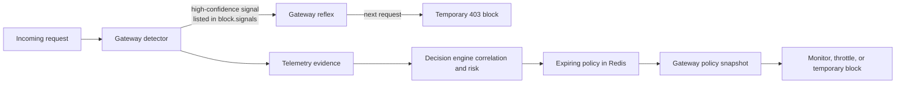

# Attack Detection and Enforcement Ownership

## Overview

This module answers two separate questions for every supported attack type:

1. Who makes the decision: the gateway reflex or the decision engine?
2. What response can the client see once that decision is active?

The map reflects the shipped `gateway/configs/config.yaml` configuration. A
decision-engine policy is *decided* asynchronously, then enforced by the gateway
from its background-refreshed policy snapshot. This preserves the request-path
rule: the gateway never waits for the decision engine to think.

## Current enforcement map

| Attack / detector | Current automatic handling |
| --- | --- |
| API flooding | **Both.** High-confidence flood evidence can arm the gateway reflex; the decision engine can later write a policy. The baseline rate limiter itself is not enabled for refusal by default. |
| Path traversal | **Both.** The matching request is observed and allowed; the gateway reflex returns `403` for later requests from that IP. The decision engine can also write a policy. |
| Sensitive-path enumeration / forced browsing | **Decision engine only.** Pure enumeration scores `50`, below the reflex minimum score of `80`. |
| SQL injection probing | **Decision engine only.** SQLi can form an immediate campaign, but `sql_injection` is not in the current reflex signal list. |
| Brute force | **Decision engine only.** It may become a monitor, throttle, or temporary-block policy, subject to adaptive guardrails. |
| Password spraying | **Decision engine only.** It is a brute-force campaign classification, not a separate gateway detector. |
| Credential stuffing | **Decision engine only.** It is the multi-IP password-spraying classification, not a separate gateway detector. |
| Unknown-route scanning | **Decision engine only.** |
| Object-ID enumeration / BOLA harvesting | **Decision engine only.** |
| Unauthorized object access / BOLA ownership violation | **Both, but not through the reflex.** The gateway ownership guard immediately hides/refuses an unauthorised object with `404`; its evidence can also inform a decision-engine policy. |
| Known-bad IP reputation | **Context only by default.** It cannot create an automatic policy on its own. It may support a campaign containing deterministic evidence, and it can be explicitly added to the gateway reflex configuration if an operator chooses to do so. |

## The two enforcement paths

### Gateway reflex

The reflex is immediate and local to the gateway. It does not block the request
that produced the evidence; it records a temporary block for the *next*
request from that IP. In the shipped configuration it is enabled for:

- `api_flooding`, when its evidence clears the `min_score: 80` floor;
- `enumeration_path_traversal`, when traversal evidence scores at least `80`.

The block TTL is `300s`. A refused request is normally `403` and does not reach
the detector chain, which is why blocked telemetry rows have no new matched
signal or risk score.

### Decision-engine policy

The decision engine groups evidence into campaigns, calculates risk and
confidence, applies the configured adaptive guardrails, and writes a policy
with a TTL. The gateway later applies that policy without a synchronous
decision-engine or model call.

- **Monitor**: records the decision but does not refuse traffic.
- **Throttle**: consumes one Redis token for each request. A request with a
  token is forwarded; a request without one receives `429 Too Many Requests`.
- **Temporary block**: the gateway returns `403` while the policy is live.

## Traversal and enumeration are one detector, not one outcome

`enumeration_path_traversal` is the canonical gateway signal, but it carries a
more specific attack type and score:

| Actual match | Score | Current result |
| --- | ---: | --- |
| Path traversal only | 80 | Reflex and decision engine |
| Sensitive-path enumeration only | 50 | Decision engine only |
| Both in the same request | 100 | Reflex and decision engine |

The dashboard label **Path traversal & enumeration** names this combined
detector. It does not itself prove both patterns matched. For example, a risk
score of `80` is traversal-only evidence; a true combined match has score
`100`.

## BOLA exception

`ownership_violation` is deliberately different from the other entries. The
gateway has already received the backend response, checks its declared owner
against the caller identity, and turns another user's object into `404 Not
found`. It is immediate gateway protection, but not a reflex block: later
requests are not refused merely because one ownership check failed. The decision
engine still receives the evidence so it can recognise a wider harvesting
campaign.

## Configuration references

| Concern | Location |
| --- | --- |
| Enabled detectors, patterns, reflex signals and TTL | `gateway/configs/config.yaml` under `enforcement:` |
| Gateway reflex | `gateway/internal/enforcement/reflex.go` |
| Detector scores and evidence | `gateway/internal/signals/` |
| Policy actions and token bucket | `gateway/internal/policy/` |
| Campaign classification and adaptive decision | `decision-engine/iasg/correlation/` and `decision-engine/iasg/adaptive/` |

