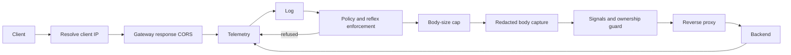

# Request Lifecycle

The chain is built outermost first. Responses unwind through it, so telemetry
can record the final status and any evidence.

1. The resolver selects one client address, trusting `X-Forwarded-For` only from configured proxies.
2. The enforcer reads its local snapshot. Blocks return `403`; an empty token bucket returns `429` with `Retry-After`.
3. The body cap runs before any body reader. Oversized and refused requests are not buffered by detectors or telemetry.
4. Detectors observe the request and response. The ownership guard can replace an unauthorized object response with `404`.
5. Completion telemetry is queued for background publishing. A full queue drops telemetry, never API latency.

Telemetry sits outside enforcement so refused requests are visible. Enforcement
sits outside detection so already-blocked traffic costs little work. The reflex
observes after response-aware detectors and only applies from the next request.

The liveness endpoint is outside this chain.
